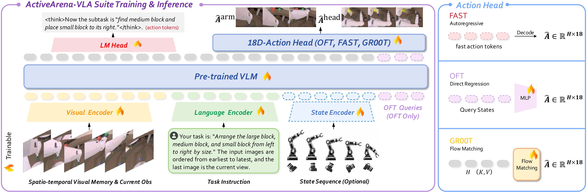

# ActiveArena-VLA

Training and serving code for vision-language-action policies on the
[ActiveArena](https://github.com/leeibo/ActiveArena) benchmark.

ActiveArena provides the simulator, tasks, demonstrations, and fixed-seed
evaluation protocol. This repository provides the model implementation,
training recipes, data conversion tools, and policy server. Released model
files are distributed separately from the code repository.

<p align="center">
  
</p>


## Released configurations

The public release contains three OFT configurations for the Astribot action
space. Each predicts 16 action steps with 18 values per step.

| Configuration | History | State | Instruction |
| --- | --- | --- | --- |
| `oft_instruction_action_12_ws` | 12 action keyframes | Yes | Task instruction |
| `oft_subtask_action_12_wos` | 12 action keyframes | No | Subtask instruction |
| `oft_subtask_action_12_ws` | 12 action keyframes | Yes | Subtask instruction |

The corresponding checkpoint bundles are available from
[ActiveArena-VLA on Hugging Face](https://huggingface.co/leeibo/ActiveArena-VLA).
The base model, training data, and simulator are separate downloads.

## Install

Use Linux, Python 3.10, an NVIDIA GPU, and a CUDA-enabled PyTorch installation.
The supplied environment uses PyTorch 2.6.0 and torchvision 0.21.0.

```bash
conda env create -f environment.yml
conda activate activearena-vla
pip install -e .
```

Download `Qwen/Qwen3-VL-2B-Instruct` at the revision specified in
[MODEL_SNAPSHOT.md](MODEL_SNAPSHOT.md):

```bash
huggingface-cli download Qwen/Qwen3-VL-2B-Instruct \
  --revision 89644892e4d85e24eaac8bacfd4f463576704203 \
  --local-dir playground/Pretrained_models/ActiveArena/Qwen3-VL-2B-Instruct
```

Set `ACTIVEARENA_VLA_BASE_VLM` if the model is stored elsewhere. Keep the base
model local during evaluation by setting `HF_HUB_OFFLINE=1`.

### Optional FAST action model

The three released configurations above use continuous OFT action heads and
only need `Qwen3-VL-2B-Instruct`. The FAST recipes in
`examples/ActiveArena_Astribot/train_files/` require a second local model with
FAST action tokens. Create it from the same base model with the bundled
StarVLA conversion utility:

```bash
python starVLA/model/modules/vlm/tools/add_qwen_special_tokens/add_special_tokens_to_qwen.py \
  --model-id playground/Pretrained_models/ActiveArena/Qwen3-VL-2B-Instruct \
  --tokens-file starVLA/model/modules/vlm/tools/add_qwen_special_tokens/fast_tokens.txt \
  --save-dir playground/Pretrained_models/ActiveArena/Qwen3-VL-2B-Instruct-Action \
  --init-strategy normal
```

Use the generated directory as `base_vlm` in the FAST configuration. This
conversion is unnecessary for the released OFT checkpoints.

## Training

Download the converted demonstrations from
[ActiveArena-Data](https://huggingface.co/datasets/leeibo/ActiveArena-Data):

```bash
huggingface-cli download leeibo/ActiveArena-Data \
  --repo-type dataset \
  --local-dir playground/dataset/ActiveArena_Astribot_lerobot
```

Set the dataset path in the selected configuration, then launch training from
this repository root:

```bash
export ACTIVEARENA_VLA_ROOT="$PWD"
export ACTIVEARENA_VLA_ENV_NAME=activearena-vla
export ACTIVEARENA_VLA_PYTHON="$(command -v python)"
export NUM_PROCESSES=4
bash examples/ActiveArena_Astribot/train_files/managed_runs/oft_subtask_action_12_ws/run_train.sh
```

Use the other configuration directory names for the other recipes. Common
launcher variables include `NUM_PROCESSES`, `CUDA_VISIBLE_DEVICES`,
`ACCELERATE_BIN`, `ACCELERATE_CONFIG`, `MAIN_PROCESS_PORT`, and `WANDB_MODE`.
Training outputs are written below `results/Checkpoints/` unless overridden by
the selected recipe.

The expected fields, action-keyframe history, subtask labels, and conversion
command are documented in [docs/data-conversion.md](docs/data-conversion.md).

## Serving a released checkpoint

Download a checkpoint bundle, install this repository, and point the server to
the checkpoint file:

```bash
MODEL=oft_subtask_action_12_ws
export ACTIVEARENA_VLA_ROOT="$PWD"
export ACTIVEARENA_VLA_PYTHON="$(command -v python)"
export POLICY_CKPT_PATH="/path/to/ActiveArena-VLA-weights/$MODEL/checkpoints/steps_100000_pytorch_model.pt"
bash "examples/ActiveArena_Astribot/train_files/managed_runs/$MODEL/run_policy_server.sh"
```

The server listens on port `7980` by default. Set `POLICY_PORT`,
`POLICY_GPU_ID`, `USE_BF16=0`, or `IDLE_TIMEOUT` when needed.

The server only provides model inference. Start the simulator and evaluation
workers from the [ActiveArena evaluation guide](https://github.com/leeibo/ActiveArena/blob/main/ACTIVEARENA_EVAL_LAUNCH.md).

## Repository map

```text
starVLA/                         model, dataloader, and trainer implementation
examples/ActiveArena_Astribot/  ActiveArena recipes and policy launchers
deployment/model_server/         policy server
script/                          data and training utilities
docs/data-conversion.md          HDF5 to LeRobot data contract
MODEL_SNAPSHOT.md                base model and runtime contract
```

## Related resources

- [ActiveArena simulator and benchmark](https://github.com/leeibo/ActiveArena)
- [ActiveArena training data](https://huggingface.co/datasets/leeibo/ActiveArena-Data)
- [ActiveArena simulation assets](https://huggingface.co/datasets/leeibo/ActiveArena-Assets)
- [ActiveArena project website](https://leeibo.github.io/ActiveArena)

## Acknowledgements

ActiveArena-VLA is built on the open-source
[StarVLA](https://github.com/starVLA/starVLA) framework. We thank the StarVLA
contributors for the model, data-loading, training, and serving components
that this repository adapts for ActiveArena.

## License and citation

This repository retains the upstream StarVLA license and attribution in
[LICENSE](LICENSE). Check the licenses of the base model, datasets, simulator,
and third-party assets before redistribution.

```bibtex
@misc{activearena_manuscript,
  title = {ActiveArena: Benchmarking and Understanding Active Perception in Robotic Manipulation},
  note  = {Manuscript submitted for review at AAAI 2027}
}
```
