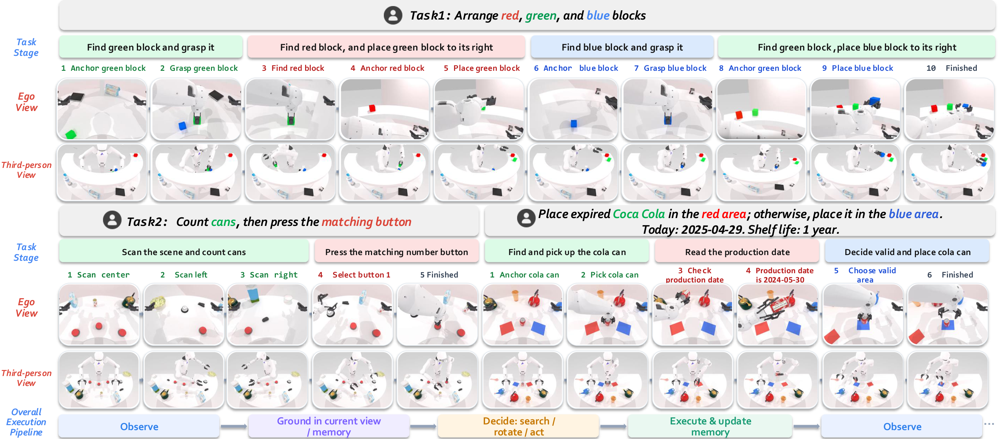

# ActiveArena-VLA

ActiveArena-VLA is the training and serving code for **ActiveArena**, a benchmark for language-conditioned robotic manipulation when the first view does not contain enough information. It adapts the modular StarVLA training stack to the Astribot S1 embodiment and packages three OFT checkpoints with their configurations and statistics.

<p align="center">
  
</p>

<p align="center"><b>Search for evidence, remember it across views, then manipulate.</b></p>

| Project | Purpose |
| --- | --- |
| [ActiveArena](https://github.com/leeibo/ActiveArena) | Frozen simulator snapshot, task suite, data collection and fixed-seed evaluation |
| **ActiveArena-VLA** | VLA training, policy servers and the released model configurations |
| [ActiveArena-VLA weights](https://huggingface.co/leeibo/ActiveArena-VLA) | Three 100,000-step checkpoint bundles with checksums |
| [Project website](https://leeibo.github.io/ActiveArena) | Visual overview, videos, release map and reproduction guide |

Public release links: [simulator](https://github.com/leeibo/ActiveArena), [training data](https://huggingface.co/datasets/leeibo/ActiveArena-Data), and [static assets](https://huggingface.co/datasets/leeibo/ActiveArena-Assets).

> **Release status.** The code is published on GitHub and the large `.pt` bundles are published at [leeibo/ActiveArena-VLA](https://huggingface.co/leeibo/ActiveArena-VLA). The source archive is retained at the workspace root; its bundled submission PDFs are AAAI formatting templates, not the ActiveArena manuscript.

## What is released

The release follows the paper's modular VLA interface: visual history, language, optional proprioception, and an OFT action head produce an 18-dimensional Astribot action. The benchmark covers 35 tasks in five categories—single-object search (SS), single-object loop (SL), multi-object decision (MD), multi-object loop (ML), and interactive information acquisition (IA). Each task has fixed ID and OOD seed lists in `ActiveArena/eval_seed_lists/`.

The paper studies 13 VLA configurations, including memory, supervision, state, action-head, and planner ablations. This release packages the following three OFT recipes and 100,000-step checkpoint bundles; it does not provide weights for all 13 configurations:

| Configuration | Framework | History | State | Instruction supervision |
| --- | --- | ---: | :---: | --- |
| `oft_instruction_action_12_ws` | `QwenOFTState` | 12 action keyframes | yes | task instruction |
| `oft_subtask_action_12_wos` | `QwenOFT` | 12 action keyframes | no | subtask instruction |
| `oft_subtask_action_12_ws` | `QwenOFTState` | 12 action keyframes | yes | subtask instruction |

Each bundle includes `config.yaml`, `config.full.yaml`, `dataset_statistics.json`, the PyTorch checkpoint, and a SHA-256 entry in the [released model manifest](https://huggingface.co/leeibo/ActiveArena-VLA/blob/main/manifest.json). The three checkpoints are about 14.9 GB in total; the code repository intentionally does not vendor them.

<p align="center">
  
</p>

The figure shows the broader suite studied in the paper. The three packaged checkpoints use the continuous OFT action head.

## Install

Use Linux, Python 3.10, an NVIDIA GPU, and a CUDA-enabled PyTorch build compatible with the pinned dependencies. Install the policy dependencies separately from the simulator. The release environment is named `activearena-vla` and is also provided as [`environment.yml`](environment.yml):

```bash
conda env create -f environment.yml
conda activate activearena-vla
pip install -e .
```

The pinned `requirements.txt` also installs `pytest`, which is used by the
release smoke tests below.

Prepare the pinned base VLM snapshot locally at `playground/Pretrained_models/ActiveArena/Qwen3-VL-2B-Instruct`, or set `ACTIVEARENA_VLA_BASE_VLM` to another compatible local snapshot. The variable is honored by training, checkpoint loading, and serving. The legacy `STARVLA_BASE_VLM` variable and the old model directory remain accepted for older checkpoints. The base VLM is distributed under its own license and is not included in this repository; see [MODEL_SNAPSHOT.md](MODEL_SNAPSHOT.md).

For a reproducible download, use the revision recorded in the release contract:

```bash
QWEN_REVISION=89644892e4d85e24eaac8bacfd4f463576704203
huggingface-cli download Qwen/Qwen3-VL-2B-Instruct \
  --revision "$QWEN_REVISION" \
  --local-dir playground/Pretrained_models/ActiveArena/Qwen3-VL-2B-Instruct
```

For a quick environment check:

```bash
python - <<'PY'
import torch, transformers
print('torch:', torch.__version__, 'cuda:', torch.cuda.is_available())
print('transformers:', transformers.__version__)
PY
```

## Train

The Astribot example configs are self-contained apart from the dataset path and base VLM. Raw demonstrations are not bundled; the released converted LeRobot demonstrations can be downloaded from the [ActiveArena-Data dataset](https://huggingface.co/datasets/leeibo/ActiveArena-Data):

```bash
huggingface-cli download leeibo/ActiveArena-Data \
  --repo-type dataset \
  --local-dir /path/to/ActiveArena-VLA/playground/dataset/ActiveArena_Astribot_lerobot
```

The paper uses 100 ID trajectories per task; collect or prepare the ActiveArena trajectories in the LeRobot layout expected by `examples/ActiveArena_Astribot/train_files/data_registry/data_config.py`, including subtask labels and the action-keyframe history. Edit `data_root_dir` in the selected config, then launch from the ActiveArena-VLA root:

```bash
export ACTIVEARENA_VLA_ROOT="$PWD"
export ACTIVEARENA_VLA_ENV_NAME=activearena-vla
export ACTIVEARENA_VLA_PYTHON="$(command -v python)"
export NUM_PROCESSES=4
bash examples/ActiveArena_Astribot/train_files/managed_runs/oft_subtask_action_12_ws/run_train.sh
```

Useful overrides are `NUM_PROCESSES`, `CUDA_VISIBLE_DEVICES`, `ACCELERATE_BIN`, `ACCELERATE_CONFIG`, `MAIN_PROCESS_PORT`, and `WANDB_MODE=offline`. The other two recipes use the same command with their directory name. Training writes checkpoints below `results/Checkpoints/<run_name>/` and saves the configuration alongside them. `RUN_OUTPUT` is a policy-server override for serving a local training run. The `STARVLA_*` variables remain compatibility aliases for older launch scripts.

The data conversion contract, a real-sample smoke command, and annotation fields are documented in [the reproduction guide](docs/reproduction.md) and [the HDF5 → LeRobot conversion guide](docs/data-conversion.md). Do not put credentials in configs; use environment variables or a local `.env` that remains untracked.

Before a multi-GPU run, validate the release tests and one real dataset sample
(run this command from the ActiveArena-VLA root):

```bash
python -m pytest -q tests
python - <<'PY'
from pathlib import Path
from starVLA.dataloader.lerobot_datasets import make_LeRobotSingleDataset
dataset = make_LeRobotSingleDataset(
    Path("playground/dataset/ActiveArena_Astribot_lerobot"),
    "beat_block_hammer_rotate_view", "activearena_astribot",
    data_cfg={"video_backend": "torchvision_av", "lerobot_version": "v2.0"},
)
sample = dataset[0]
assert sample["action"].shape == (16, 18)
print("ActiveArena dataset smoke OK", len(dataset))
PY
```

The default test command intentionally excludes historical RoboCasa/RoboTwin
compatibility tests whose source examples are not part of this ActiveArena
snapshot; they can be invoked explicitly when those legacy examples are
restored.

## Serve a released checkpoint

Use the prepared sibling weights directory, or download a bundle from the public model repository. From the ActiveArena-VLA root, verify the weights and point the policy server to the checkpoint:

```bash
cd /path/to/ActiveArena-VLA-weights
sha256sum -c SHA256SUMS

cd /path/to/ActiveArena-VLA
export ACTIVEARENA_VLA_ROOT="$PWD"
export ACTIVEARENA_VLA_PYTHON="$(command -v python)"
export POLICY_CKPT_PATH="/path/to/ActiveArena-VLA-weights/oft_subtask_action_12_ws/checkpoints/steps_100000_pytorch_model.pt"
bash examples/ActiveArena_Astribot/train_files/managed_runs/oft_subtask_action_12_ws/run_policy_server.sh
```

The server listens on port `7980` by default. Set `POLICY_PORT`, `POLICY_GPU_ID`, `USE_BF16=0`, or `IDLE_TIMEOUT` when needed. The evaluation client is started from the [ActiveArena evaluation guide](https://github.com/leeibo/ActiveArena/blob/main/ACTIVEARENA_EVAL_LAUNCH.md).

## Repository map

```text
starVLA/                         frozen vendored model, dataloader and trainer
examples/ActiveArena_Astribot/  three train/server recipes and data registry
deployment/model_server/         websocket policy server
docs/reproduction.md             data contract and end-to-end release recipe
docs/images/                     paper-derived release figures
MODEL_SNAPSHOT.md                frozen source/model and runtime contract
```

## Attribution and license

This repository keeps the upstream StarVLA MIT license and attribution in [LICENSE](LICENSE). ActiveArena-specific benchmark code and assets are released under the accompanying licenses in the two project repositories. Check the original RoboTwin, Astribot, Qwen, and base-model licenses before redistribution.

## Citation

```bibtex
@misc{activearena_manuscript,
  title = {ActiveArena: Benchmarking and Understanding Active Perception in Robotic Manipulation},
  note  = {Manuscript submitted for review at AAAI 2027}
}
```

The supplied source does not establish the manuscript's author list, public URL, or DOI. This temporary entry deliberately omits those fields and does not imply acceptance. Replace it with the verified manuscript citation when available. For contribution and issue guidance, see [CONTRIBUTING.md](docs/CONTRIBUTING.md).
